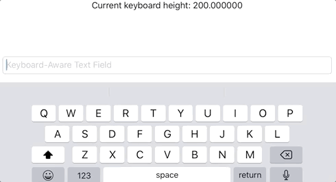

**KeyboardSupport** is set of _SwiftUI_ modifiers to make your views keyboard-aware. Whether to get the software keyboard dimensions via `.keyboardFrameProvider()`. Or by using `.keyboardAware()` to automatically pull up a view whenever the keyboard pops in.



# Examples

## Automatically adjust to keyboard presence

```swift
var body: some View {
  VStack {
    Spacer()
    TextField("Keyboard-Aware Text Field", text: $value)
    .keyboardAware()
  }
  .padding()
}
```


## Obtain keyboard dimensions

```swift
struct KeyboardHeightDisplay: View {

  @Environment(\.keyboardFrame) var keyboardFrame

  var body: some View {
    Text("Current keyboard height: \(keyboardFrame.size.height)")
  }
}

struct KeyboardHeightDisplay_Container: View {

  var body: some View {
    KeyboardHeightDisplay().keyboardFrameProvider()
  }
}
```

More info [in the docs](doc).

# Installation via SPM

In _XCode_ add the following URL to your project's _Swift Package_ dependencies:

 `https://github.com/swiftuilib/keyboard-support`

# Development

To modify the package contents while still being able to see SwiftUI _Previews_ use the provided `KeyboardSupportPreview.xcodeproj`.
